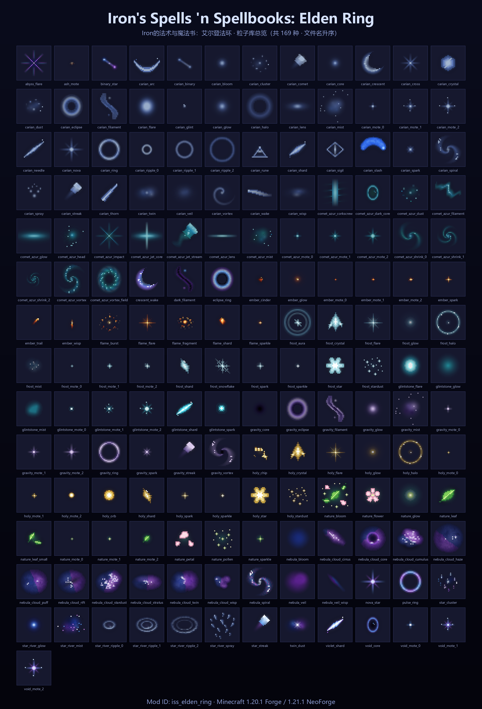

# Iron's Spells: Elden Ring — Particle Library

[中文](README.md) | **English**

- Particle library of the Minecraft mod **"Iron's Spells 'n Spellbooks: Elden Ring"**. It stores original pixel-art particle PNGs and can also be used on its own as a general-purpose particle texture pack.
- Most particles are **32×32**.
- Repository: https://github.com/shuimo0413/Iron-Elden-Ring-Particle-library

## Relationship with the main project

This folder lives in the parent directory of the dual-version workspace (next to `工具链/` (toolchain) and `模型/` (models)). Both the Forge 1.20.1 and NeoForge 1.21.1 projects mount it as `粒子库/` via a Windows **junction**, so:

1. Put new particle PNGs directly into this folder;
2. When a particle is needed in-game, copy it into the target project's `assets/iss_elden_ring/textures/particle/`;
3. For the showcase image, see `tool/gen_particle_showcase.py` below (files are laid out in ascending filename order; no script changes required).



## Particle families

Files are grouped by filename prefix, for example:

| Prefix | Theme |
|---|---|
| `carian_*`, `glintstone_*`, `comet_azur_*` | Carian / glintstone sorcery (blue) |
| `gravity_*`, `void_*`, `nebula_*`, `star_*` | Gravity, void and astral effects |
| `frost_*` | Frost magic |
| `holy_*` | Holy golden light |
| `ember_*`, `flame_*` | Fire and embers |
| `nature_*` | Nature / life |

Numbered files such as `*_mote_0/1/2.png` or `*_ripple_0/1/2.png` are animation frames or size variants of the same particle.

## tool/ — pixel JSON ↔ PNG / showcase image

Pixel JSON format: `name`, `width`, `height`, `pixels` (each entry has `x` / `y` / `rgba: [R, G, B, A]`).

`tool/origin_json/` holds the source pixel JSON for some particles, and the `tool/gen_*_particles.py` scripts procedurally generate particle families (frost, holy, fire, nature) and export them to PNG.

### `render_pixel_art.py` — JSON → PNG

Have an LLM (or a human) produce pixel JSON following the format above, then assemble the PNG with this script.

```powershell
# Adding a particle to the library: logical pixels 1:1, do not upscale
python tool/render_pixel_art.py my_particle.json --png-scale 1 -o my_particle.png

# Enlarged console preview (default --png-scale 16, good for inspecting structure)
python tool/render_pixel_art.py my_particle.json -s 2
```

### `extract_image_rgba.py` — image → JSON

Extracts every RGBA pixel from an existing PNG (or any format Pillow can read) into JSON in the same format. Fully transparent pixels (`A == 0`) are skipped by default.

```powershell
python tool/extract_image_rgba.py glintstone_spark.png
python tool/extract_image_rgba.py glintstone_spark.png -o spark.json --unique
# Keep fully transparent pixels: --min-alpha 0
```

In the main project, the old `工具链/render_pixel_art.py` remains as a compatibility entry point (it forwards to this file), so existing `gen_*` scripts need no changes.

### `gen_particle_showcase.py` — all PNGs → showcase image

Scans every `*.png` in the library root (automatically excluding `粒子库预览.png`), arranges them in **ascending filename order** into one showcase image, and writes `粒子库预览.png`. There is no family grouping; just rerun it after adding new particles.

```powershell
# From the particle library root
python tool/gen_particle_showcase.py

# Or from either project root (compatibility forwarder)
python 工具链/gen_particle_showcase.py
```

Requires Python 3 and [Pillow](https://pypi.org/project/pillow/).

## License

This library (particle PNGs and `tool/` scripts) is released under the [MIT License](LICENSE).
